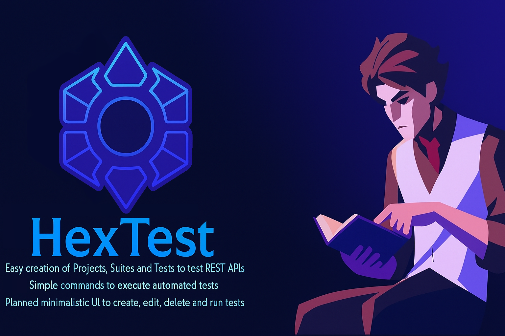

 <!-- markdownlint-disable -->

  

 
  

  

  

  

  

---

# HexTest  

HexTest is a **CLI application and Go package** built to make **REST API testing simple, structured, and accessible**.  

The primary goal is to help **QA engineers with little coding experience** quickly set up automated API tests, while also providing the flexibility for **developers and advanced QA engineers** to extend and integrate it as a Go package.  

✨ Key Highlights:

- **CLI-first approach** → Run and manage tests with simple commands  

- **Organized testing** → Create projects, suites, and tests with minimal setup  

- **JSON support** → Import/export test definitions for easy sharing  

- **Automation-friendly** → Execute tests in pipelines or local environments  

- **Future UI** → Planned HTMX + Templ based local interface for managing tests visually  

---

## 👤 About Me  

Hi, my name is Gustavo Poroca, I am a **Jr QA Engineer** who loves to code and explore new challenges and opportunities.  

Always learning, always building 🚀  

🔗 [Connect with me on LinkedIn](https://www.linkedin.com/in/gustavo-poroca/)  

---

## 🛠️ Roadmap  

- ✅ Start project [DONE]

- ✅ Create each data structure for tests, suites and projects [DONE]  

- ⏳ Create auth handler [TODO]  

- ⏳ Create simple tests for the already written code [TODO]  

- 🚧 Create mockServer and client for demonstration [WIP]  

- ✅ Create JSON parser to project data [DONE]  

- ⏳ Create CLI tool to run some tests [TODO]  

- 🚧 Create visual interface with HTMX + Templ [WIP]  

- ⏳ Upgrade documentation (make section 4 and 5) [TODO]  

- ⏳ Import API Schemas from other sources [TODO]

> This roadmap is just the beginning and will evolve as HexTest grows.  

---

## 📦 Installation [TODO]  

  
---

## 🚀 How to Use [TODO]

---
