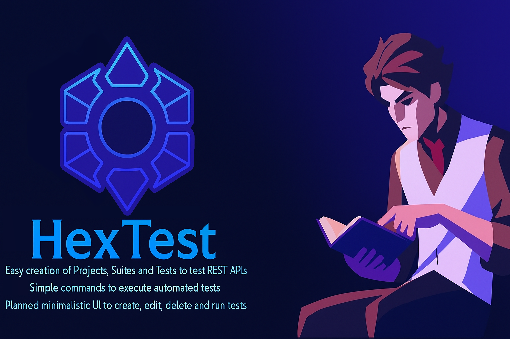

 <!-- markdownlint-disable -->
<p align="center">

  

</p>

<div align="center"> 
  <p align="inline">

  <a href="https://golang.org/"></a>

  <a href="LICENSE"></a>

  

  </p>
</div>

---

# HexTest  

HexTest is a **CLI application and Go package** built to make **REST API testing simple, structured, and accessible**.  

The primary goal is to help **QA engineers with little coding experience** quickly set up automated API tests, while also providing the flexibility for **developers and advanced QA engineers** to extend and integrate it as a Go package.  

✨ Key Highlights:

- **CLI-first approach** → Run and manage tests with simple commands  

- **Organized testing** → Create projects, suites, and tests with minimal setup  

- **JSON support** → Import/export test definitions for easy sharing  

- **Automation-friendly** → Execute tests in pipelines or local environments  

- **Visual editor** → Local HTMX + Templ web UI for building test projects  

---

## 👤 About Me  

Hi, my name is Gustavo Poroca, I am a **Jr QA Engineer** who loves to code and explore new challenges and opportunities.  

Always learning, always building 🚀  

🔗 [Connect with me on LinkedIn](https://www.linkedin.com/in/gustavo-poroca/)  

---

## 🛠️ Roadmap  

- ✅ Start project [DONE]

- ✅ Create each data structure for tests, suites and projects [DONE]  

- 🚧 Create auth handler [WIP]  

- 🚧 Create simple tests for the already written code [WIP]  

- ✅ Create mockServer and client for demonstration [DONE]  

- ✅ Create JSON parser to project data [DONE]  

- ✅ Create CLI tool to run some tests [DONE]  

- ✅ Create visual interface with HTMX + Templ [DONE]  

- 🚧 Upgrade documentation [WIP]  

- ⏳ Import API Schemas from other sources [TODO]

> This roadmap is just the beginning and will evolve as HexTest grows.  

---

## 📁 Project Layout

```
cmd/
  hextest/         Main CLI entrypoint (execute, front, example_server, auth)
  exampleserver/   Standalone binary for the bundled demo REST API
internal/
  exampleserver/   Demo REST API + handlers + tests (also served by `hextest example_server`)
pkg/
  typeDefines/     Core domain: Project → Suite → Test → Assert → Check, and the assertion engine
  jsonOperations/  Read/write project files to and from JSON
server/            Local web UI (templ + HTMX) handlers
front/             templ components for the web UI
examples/          Ready-to-run project files (see examples/README.md)
docs/              Longer-form documentation
assets/            Images used by the README and web UI
```

Common commands:

```sh
go test ./...                                  # run the test suite
go run ./cmd/exampleserver                      # start the demo API on :3443
go run ./cmd/hextest execute examples/demo-project.json
make build                                      # build ./bin/hextest
```

---

## 📦 Installation

**Prerequisites:** [Go 1.24+](https://go.dev/dl/) and `git`. (You only need the
[`templ`](https://templ.guide) CLI if you plan to edit the web-UI components.)

```sh
git clone https://github.com/GuPoroca/HexTest.git
cd HexTest

# Option A – run straight from source
go run ./cmd/hextest <command>

# Option B – build a binary into ./bin/hextest
make build
./bin/hextest <command>

# Option C – install `hextest` onto your PATH
go install ./cmd/hextest
```

Run `hextest` with no arguments to see the command list.

---

## 🚀 Quick Start — run the whole thing end to end

HexTest ships with a small demo REST API so you can see a full run without
pointing it at a real service. Open **two terminals** in the repo root.

**Terminal 1 — start the demo API (listens on `:3443`):**

```sh
go run ./cmd/exampleserver
# -> Example Server running on :3443
```

**Terminal 2 — run the demo project against it:**

```sh
go run ./cmd/hextest execute examples/demo-project.json
```

You'll get per-failure details followed by a summary:

```
Comparisson: 3015 <= 1000.000000
On Assert: Response Time
On Test: Slow Endpoint Fails Time Assertion
On Suite: Testing Suite
FAILED

Number of Checks Made: 15
Number of Checks Passed: 12
Number of Checks Failed: 3
Number of Checks Broken: 0
```

> The 3 failures in the demo are **intentional** — the demo server has a
> deliberately slow endpoint and a randomly-shaped response so you can see what
> failures look like.

That's the whole loop: **a project file + a running API + `hextest execute`.**
To test your own API, change `Url` in a project file (or write a new one) and
point it at your service.

---

## 🧪 Writing a project file

A project is a JSON file with this shape:

```
Project ─┬─ Name, Url, Parallel, Project_Headers, Auth
         └─ Suites [] ─┬─ Name, Parallel
                       └─ Tests [] ─┬─ Name, Method, Api_endpoint,
                                    │   Request_body, Request_Headers, Comment
                                    └─ Asserts [] ─┬─ Field  (what to check)
                                                   └─ Checks [] ─ Operand + Expected []
```

Minimal example (`examples/single-get.json` is a runnable version):

```json
{
  "Name": "My API",
  "Url": "http://localhost:8080",
  "Parallel": false,
  "Suites": [
    {
      "Name": "Smoke",
      "Tests": [
        {
          "Name": "Health check returns 200 and a status key",
          "Method": "GET",
          "Api_endpoint": "/health",
          "Request_body": "",
          "Asserts": [
            { "Field": "Response Status", "Checks": [ { "Operand": "==", "Expected": [200] } ] },
            { "Field": "Response Body",   "Checks": [ { "Operand": "containsKey", "Expected": ["status"] } ] }
          ]
        }
      ]
    }
  ]
}
```

- `Url` + each test's `Api_endpoint` are joined to form the request URL.
- `Parallel: true` on a project runs its suites concurrently; on a suite it runs
  its tests concurrently.
- `Request_body` is a **string** — for JSON bodies, escape the inner quotes.
- More detail and examples: [`docs/documentation.md`](docs/documentation.md) and
  the [`examples/`](examples/README.md) folder.

### Assertable fields (`Field`)

| Field | Checks against |
| --- | --- |
| `Response Body` | the parsed JSON body |
| `Response Status` | numeric status code, e.g. `200` |
| `Response Time` | round-trip time in **milliseconds** |
| `Response Size` | full response size in **bytes** |
| `JSON Schema Validation` | body validated against a JSON Schema string in `Expected` |
| `Value of Body.<path>` | a nested value, e.g. `Value of Body.user.id` |
| `Value of Headers.<name>` | a single response header, e.g. `Value of Headers.Content-Type` |
| `Type of Body[.<path>]` | the type of the body/value: `object`, `array`, `string`, `number`, `date` |

### Check operands (`Operand`)

| Group | Operands |
| --- | --- |
| Compare (numbers & dates) | `==` `!=` `>=` `<=` `>` `<` |
| Text | `matchRegex` `notMatchRegex` `containsSubstring` |
| JSON keys | `containsKey` · `containsKey -R` (recursive) |
| Presence / emptiness (no `Expected` needed) | `isNull` `notNull` `isEmpty` `notEmpty` |

**Tip:** `Expected` is a list — pass several values to assert them all at once:

```json
{ "Operand": "containsKey", "Expected": ["id", "name", "email"] }
```

### Reading the results

`hextest execute` counts every individual check and reports:

- **Passed** — the check held.
- **Failed** — the check ran but the comparison was false (printed with the
  offending value, assert, test and suite).
- **Broken** — the check could not run (e.g. an unknown operand, or the field
  couldn't be resolved from the response).

---

## 🖥️ Web UI (visual project editor)

```sh
go run ./cmd/hextest front      # run from the repo root – serves ./assets
# -> Starting frontend on :3773
```

Open <http://localhost:3773>. The UI (templ + HTMX + Tailwind, loaded from CDN)
lets you **build a project visually** — add suites, tests, asserts and checks —
and **import / export** the project JSON. Export the file, then run it with
`hextest execute`. (Running tests from inside the UI is not wired up yet.)

---

## 🔐 Auth — fetching an OAuth2 token

`hextest auth` performs an OAuth2 **client-credentials** grant and prints the
access token. It reads a `.env` file in the working directory:

```sh
cp example.env .env
```

```env
CLIENT_ID=client-id-example
CLIENT_SECRET=client-secret-example
Token_URL=http://localhost:3443/auth
```

With the demo server running (`go run ./cmd/exampleserver`):

```sh
go run ./cmd/hextest auth
# -> demo-token-123456
```

Point `Token_URL` / `CLIENT_ID` / `CLIENT_SECRET` at your real identity provider
to use it for your own APIs. (Wiring the token automatically into test requests
is still in progress.)

---

## 🛠️ Development

```sh
make test                    # go test ./...
make build                   # build ./bin/hextest
make build-exampleserver     # build ./bin/exampleserver
make run-example             # go run ./cmd/exampleserver
make templ                   # regenerate templ components with hot reload (needs `templ`)
air                          # hot-reload the CLI during development (needs `air`)
```

The `*_templ.go` files under `front/` are generated from the `.templ` sources
and committed, so you don't need `templ` unless you change a component.

---
